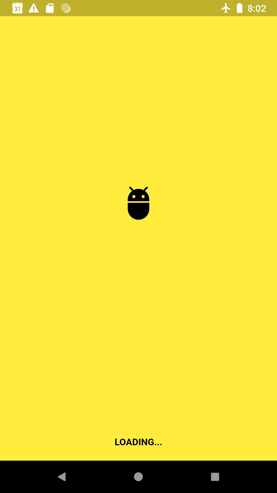
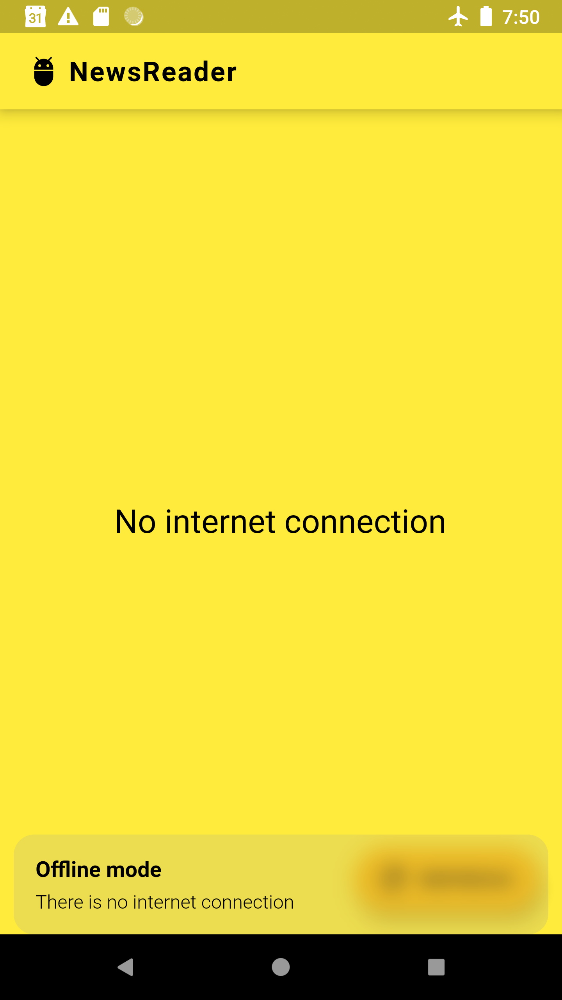

# GetX NewsAPI

A clean architecture news app, using [Getx](https://pub.dev/packages/get), [GetX CLI](https://pub.dev/packages/get_cli), [NewsAPI](https://newsapi.org/) and Flutter sdk.

The main goal is to build readble, maintainable, testable, and high-quality flutter app using test-driven-design styled architecture (Inspired by [Reso Coder](https://resocoder.com/)).

You can learn how to implement the architecture here: [TDD Clean Architecture for Flutter](https://github.com/ResoCoder/flutter-tdd-clean-architecture-course)

## Screenshots

   

## Technologies
 
### Architecture
- **Test-driven-design**
- **MVC (generated by GetX CLI)**

### Front-end
- **Flutter SDK**
- **GetX (navigation service, dependencies manager, ui components)**
- **Bloc / Cubit / GetX (state managment)**

### Back-end
- **SQLite**
- **Sembast**
- **Hive**
- **NewsAPI** 

## Features

- **Loading view (splash screen with app logo)**
- **Main view (articles view, 'REFRESH' button to load new data from the api)**
- **Network sensitive icon (in the right side of the app bar). I achieved this functionality by listening to onConnectivityChanded stream from Connectivity plugin**
- **Automatically detect offline mode on start up, and fetch local stored articles if exists. Listen to connectivity changes - when there is an online connection, fetch new data from api and update view with new articles.**
- **When fetching new data from the api, the data is stored locally, so the user can read the articles while offline. The articles shown in offline mode are the latest fetched articles.**
- **'REFRESH' botton functionality - show error message when the user try to load new data when device is offline, or fetching new data from the api ends with a failure**
- **fetch articles functionality - return with either data (articles), or feilure (http error, empty data, offline state). Update view according to the value returned from the function (data widget, failure widget)**

- **Note: The main view state managment is implemented with GetX, BloC, Bloc (for comparison purpuses)**

# Author 🙋

-   **Omer Gamliel** - [LinkedIn](https://www.linkedin.com/in/omer-gamliel-6a813a188/)
